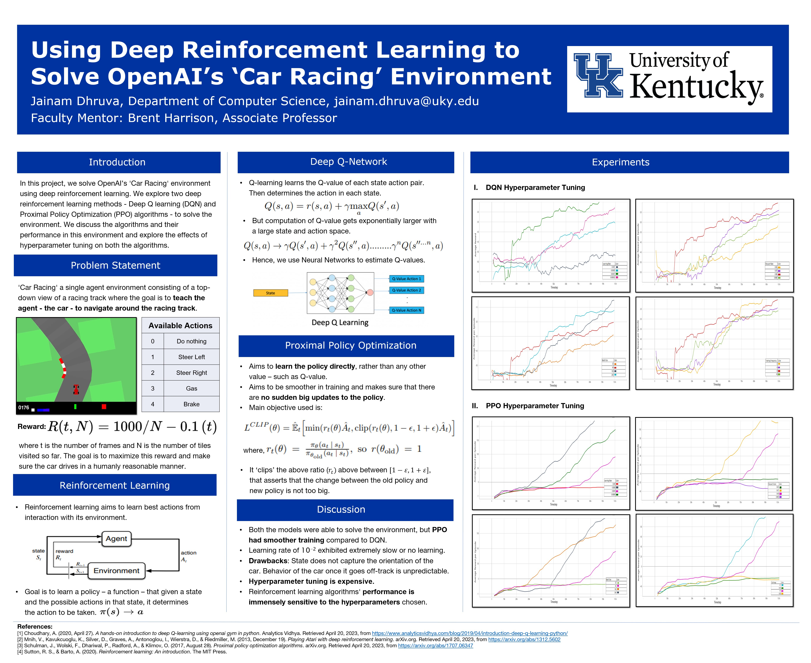

# Using Deep Reinforcement Learning to Solve OpenAI’s ‘CarRacing’ Environment

### Undergraduate Thesis
[Using Deep Reinforcement Learning to Solve OpenAI’s ‘CarRacing’ Environment](https://github.com/jdhruva03/CarRacing/blob/main/Thesis.pdf)
 
 

Reinforcement learning is a subset of machine learning which involves an agent
learning from interactions with an environment. We maximize the agent’s
reward and through that learn good behavior for our agent. Reinforcement
learning algorithms have proven effective in solving sequential decision-making
problems in various fields.OpenAI Gym is a popular platform for testing and
benchmarking reinforcement learning algorithms, offering different environments for testing agents. One such environment is the racing gym, which
requires the agent (a car) to navigate a racing track, avoid obstacles and
complete laps as quickly as possible. In this project, we try to solve OpenAI’s
racing gym. The text explores two popular reinforcement learning algorithms,
Deep Q learning (DQN) and Proximal Policy Optimization (PPO), for solving the racing gym problem. The text compares the performance of the two
algorithms, investigates various hyperparameters, and identifies the optimal
hyperparameters to train the final models. We discuss some key observations
that went into setting up and performing the experiments for hyperparameter
tuning. The text can be used as a reference by others to solve similar environments, and save time doing so, using the described reinforcement learning
methods in this project.

